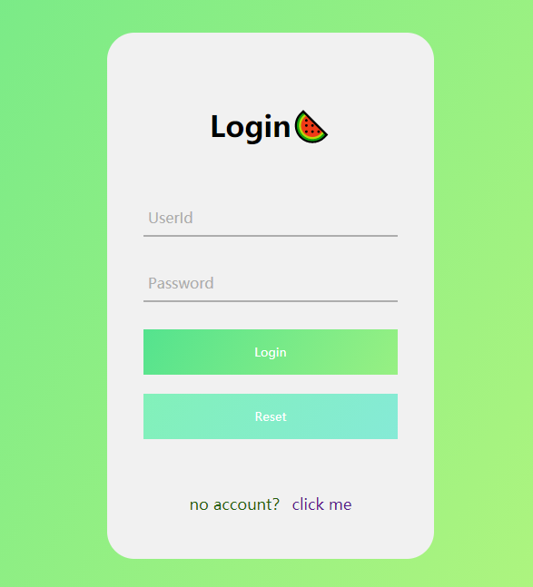
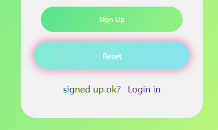

# J2EE-Demo-for-Login-Register
Based on Servlet+JSP+MySQL with a UserId check ajax
#### 一个简单的登录/注册的Demo学习案例，附带ajax校验注册UserId是否已注册的功能。
#### 登录后转到Info.jsp展示从Session获取到的用户信息。
下面是截图展示：

#### 登陆界面，登录和注册按钮有动效

#### 用户名在数据库已存在的情况

#### 用户名可注册的情况

**[2020.9.26] 修改原来的按钮形状为圆角，加入缩放和发光CSS动画：**

#### 按钮CSS动画（缩放、发光、颜色变幻）

功能比较简单以作学习记录。

**IDE：IDEA 2020.2.1 ULTIMATE

Server:Tomcat 8.5.57

JDK:1.8**
